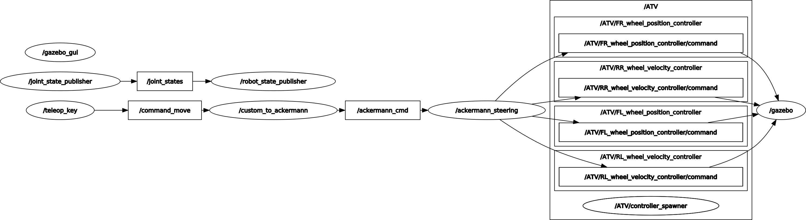

# implementation on the ATV hardware

The current branch focusses on the simulation of an ATV that can be controlled either by a PS4 controller or keyboard inouts.
The code is devided in 3 layers:
- inner layer: composed of the ATV model dinamics and mechanics;
- mid-layer: composed of the "action_control_unit" package that translates the custom "movement" messages to "ackermann_drive" messages, used in the inner layer;
- outer layer: made of different types of input (currently only PS4 controller and keyboard inputs, but other form of control can be added).

ROS version: Melodic \
dev_ws: "ATV_ws"


Current packages: 
- action_control_unit -> translates the custom "movement" messages to "ackermann_drive" messages
- ATV_control -> for actuator implementation, needed for wheel steering and spinning
- ATV_description -> dedicated to ATV models and representation
- ATV_gazebo -> dedicated to different worlds and gazebo/rviz representation
- teleop_key -> command ATV from keyboard input
- teleop_joy -> command ATV from joystick input

--------------

### Nodes and topics graph



The image, generated using `rqt_graph`, shows the active nodes and topics: the `/teleop_key` node sends the keyboard inputs through the `/command_move` topic to the `/custom_to_ackermann` node that translates the custom `/movement` message into the more common `/ackermann_drive` message. From this point onwards the structure is the same as atv_playground branch. 

In the background `joint_state_publisher` and `robot_state_publisher` are always publishing thrpugh `/tf` allowing a visualisation on Rviz.

(this is the simple version without any additional sesor and using the keyboard teleopration, you can have the actual graph of at your current state running `rqt_graph` at any point in a new terminal, while the simulation is running)  
 
--------------

### Launch command

  ```sh
cd autonomous_ATV/ATV_ws
catkin_make
source devel/setup.bash #remember to source the enviroment in every cmd window
  ```
### Spawn the ATV in a specific world:

launch empty world with ATV in the origin:
  ```sh
roslaunch ATV_description launch_ATV.launch
  ```
launch agribot world with ATV in it:
  ```sh
roslaunch ATV_gazebo agriculture_world.launch
  ```

### Connect a teleoperation device:

teleoperating with keyboard:
```sh
launch ATV_control teleop_key.launch 
#launch ATV_control teleop_key_sim_only.launch  if you want to control emergency stop and stepper motor signals
  ```
teleoperating with PS4 controller:
```sh
rosrun ATV_control teleop_joy.launch
#rosrun ATV_control teleop_joy_sim_only.launch if you want to control emergency stop and stepper motor signals
  ```
