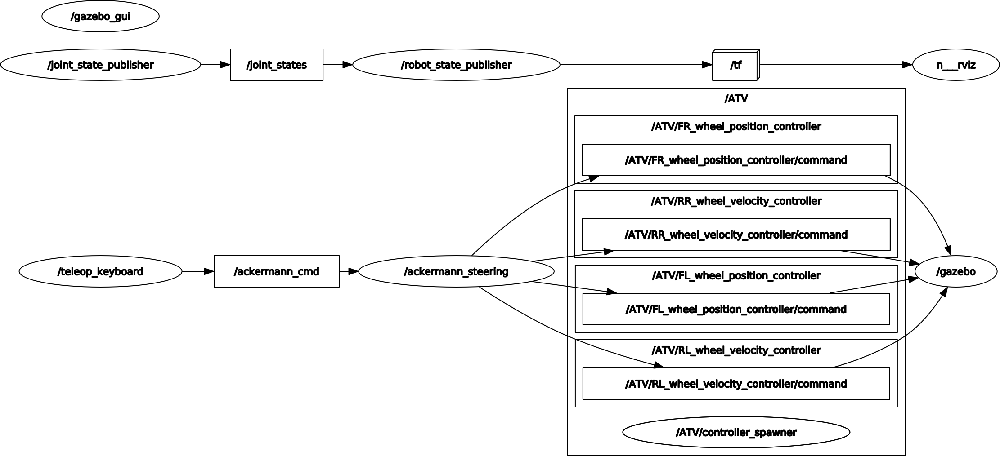

# autonomous_ATV
Development of autonomous driving capabilities for an ATV, in collaboration with the department of Agricultural Science of the Helsinki University

## atv_playground
This branch is ment to be an easier introduction to the proper "atv_simulation". 
Here the inputs and control may look easier and additional sensors are already prepared (3D camera, 2D lidar, IMU and GPS).
The main difference from the simulation enviroment are the inputs: 
- desired velocity (that can be also negative)
- the desired global steering angle (not the single variation between timeframs)
Which, compared to the simulation (which rewuires unisgned velocity, direction and angle adjustament), make the approach and the development of autonomous driving scripts easier.


ROS version: Melodic 

dev_ws: "ATV_ws"

current packages:
- ATV_description -> for ATV model and world visualization
- ATV_control -> for actuator implementation
- ATV_gazebo -> for launching everything in a specific complex world 
- teleop_key -> command ATV from keyboard input
- teleop_joy -> command ATV from joystick input

--------------

### Launch command
  ```sh
cd autonomous_ATV/ATV_ws
catkin_make
source devel/setup.bash
  ```
### Spawn the ATV in a specific world:

launch empty world with ATV in the origin:
  ```sh
roslaunch ATV_description launch_ATV.launch
  ```
launch agribot world with ATV in it:
  ```sh
launch ATV_gazebo agribot_farm.launch
  ```


### Connect a teleoperation device:
teleoperating with keyboard:
```sh
launch ATV_control teleop_key.launch
  ```
teleoperating with PS4 controller:
```sh
rosrun ATV_control teleop_joy_ps4.launch
```

--------------

### Nodes and topics graph



The image, generated using `rqt_graph`, shows the active nodes and topics: the `/key_teleop` node sends the keyboard inputs through the `/ackerman_cmd` topic to the `/ackermann_steering` node that translates the `/ackerman_drive` message into specific wheel spinning velocity or turning radius. 
The values are sent to the specific actuator located under the namespace `ATV` which are forwarded to the simluating eviroment, Gazebo.

In the background `joint_state_publisher` and `robot_state_publisher` are always publishing thrpugh `/tf` allowing a visualisation on Rviz.

(this is the simple version without any additional sesor and using the keyboard teleopration, you can have the actual graph of at your current state running `rqt_graph` at any point in a new terminal, while the simulation is running)  
 
--------------
 
### Roadmap:

(just as reference of how the work has been organized throughout the project)

- enviroment setup (ros workspace + gazebo)  
- URDF model of the atv (needed for a proper Gazebo/Rviz/ROS simulation)
- creation of an initial .launch file just to spaun the atv
- creation of different .world files, to have different scenarios
- addition of transmission and actuators to the URDF (to allow wheel spinning/steering) 
- anable moovement using scrips (initial tests for the keyboard teleoperation)
- study of the Ackermann steering and best possible implementation 
- actual implementation of Ackerman steering script
- keyboard teleopration scripts
- PS4 controller teleopration scripts
- connection of Rviz and visualization setup
- sensor implementation in atv URDF

### Future steps: 

(what I would do in order to reach autonomous driving)

Since the goal of the project is to develop an autonomous driving ATV, the core areas to work on are **AUTONOMOUS PATH PLANNING** and **OBSTACLE AVOIDANCE**.

The first allows to move the ATV from point A to point B (and tipically uses some sensor fusion between a world-reference sensor sach as a GPS, and a relative sensor such as an encoder/IMU).

The second ensures to avoid unexpected objets in the way and acts differently depending on the situation (stops the atv or drives it arround the obstacle).

